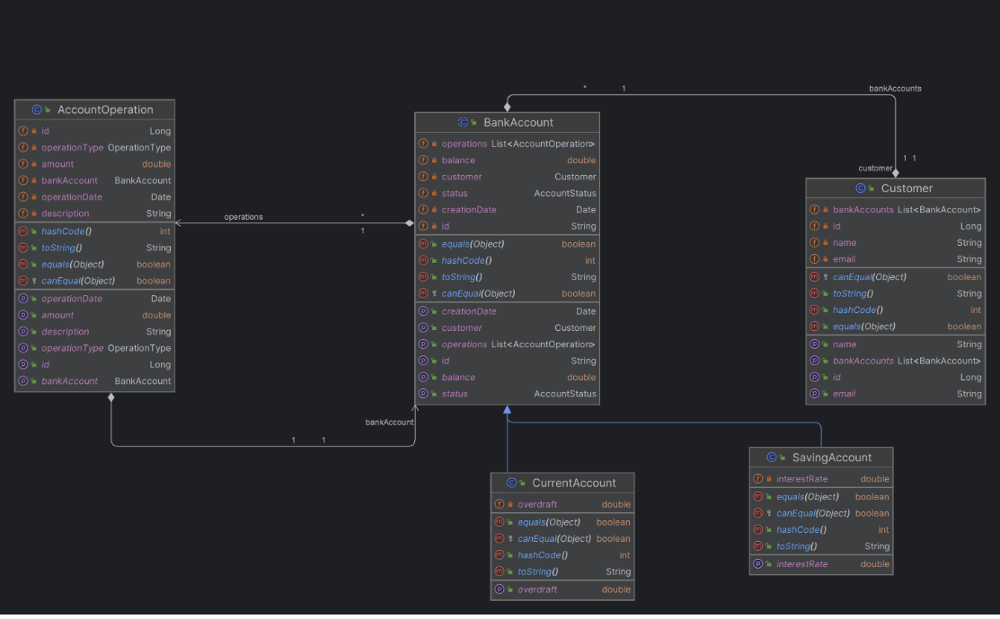
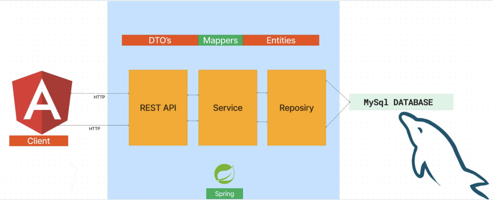
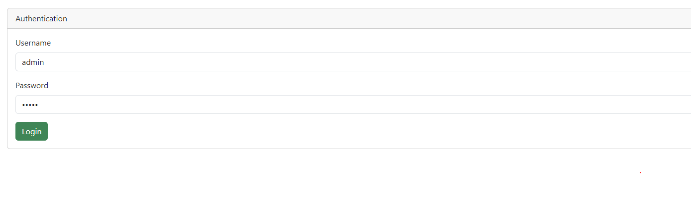
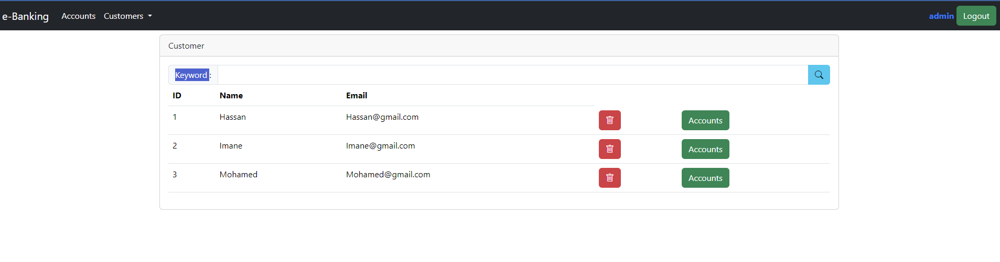
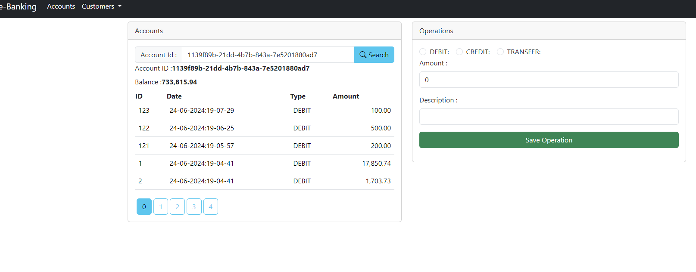

# Projet de Banque Digitale

Ce projet est une application web pour la gestion des clients et de leurs comptes. Il offre diverses fonctionnalités telles que les opérations CRUD des clients, la visualisation des comptes et des opérations, et l'exécution de transactions financières.

## Technologies Utilisées

- Backend : Spring Boot
- Frontend : Angular
- Base de données : MySQL

## Fonctionnalités

- Authentification et autorisation des utilisateurs
- Gestion des clients (Créer, Lire, Mettre à jour, Supprimer)
- Gestion des comptes (Recherche)
- Opérations sur les comptes (Débit, Crédit, Transfert)
- Fonctionnalité de recherche
- Interface utilisateur réactive
## Diagramme de classe

## Architecture de l'application

## Backend

Le backend du projet de banque digitale est développé en utilisant le framework Spring Boot. Il fournit les API nécessaires pour la gestion des clients, des comptes et des opérations.

### Points de Terminaison API

- `/customers` : méthode GET : Récupère tous les clients.
- `/searchCustomers` : Recherche les clients par nom ou email.
- `/customers/{id}` : méthode GET : Récupère un client spécifique par ID.
- `/customers` : méthode POST : Crée un nouveau client.
- `/customers/{id}` : méthode PUT : Met à jour un client existant.
- `/customers/{id}` : méthode DELETE : Supprime un client.
- `/bank-accounts` : méthode GET : Récupère tous les comptes.
- `/bank-accounts/{id}` : méthode GET : Récupère un compte spécifique par ID.
- `bank-accounts/{id}/history` : méthode GET : Récupère l'historique des transactions d'un compte.
- `/bank-accounts/{id}/account-history` : méthode GET : Récupère l'historique d'un compte avec pagination et taille.
- `/bank-accounts/{id}/debit` : méthode POST : Débite un compte.
- `/bank-accounts/{id}/credit` : méthode POST : Crédite un compte.
- `/bank-accounts/{id}/transfer` : méthode POST : Transfère de l'argent entre des comptes.
- `/bank-accounts/customer/{customerId}` : méthode GET : Récupère tous les comptes d'un client.

## Frontend

Le frontend du projet de banque digitale est développé en utilisant le framework Angular. Il fournit une interface utilisateur intuitive pour interagir avec l'application.

### Routes

- `/login` : Page de connexion.
- `/admin/customers` : Page de la liste des clients.
- `/admin/new-customer` : Ajouter un client à la liste.
- `/admin/accounts` : Page de la liste des comptes.
- `/admin/customer-accounts/:customerId` : Liste des comptes d'un client.
- `/admin/not-authorized` : Page de non-autorisation.

### Réalisation

